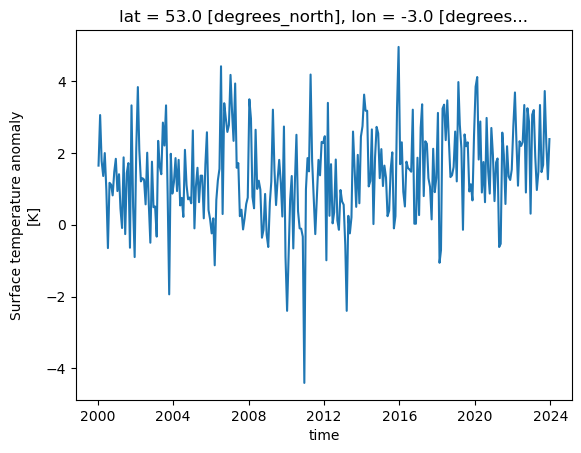
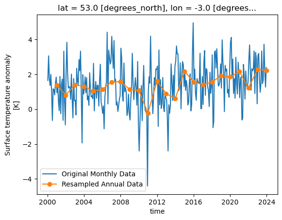
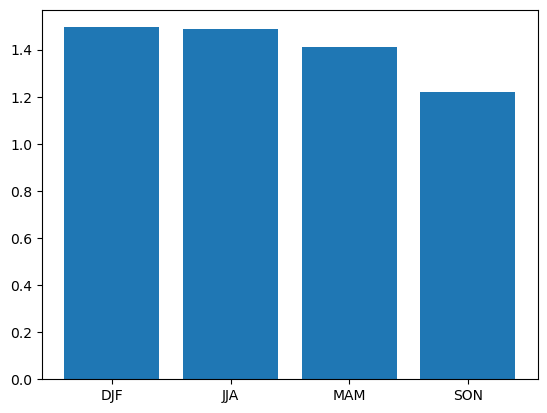
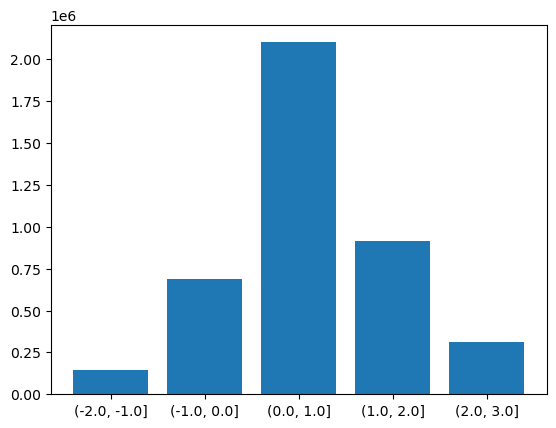
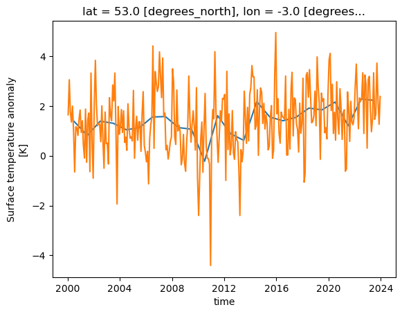
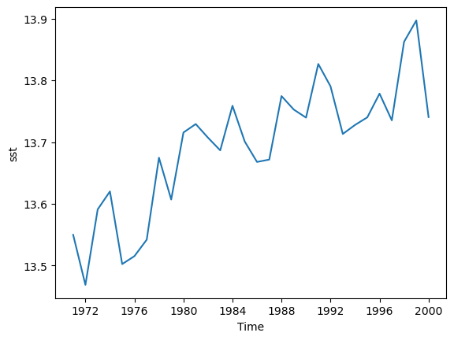

# Introducing Xarray

Xarray is a library for working with multidimensional array data in Python. Many of its ways of working are inspired by Pandas but Xarray is built to work well 
with very large multidimensional array based data. It is designed to work with popular scientific Python libraries including NumPy and Matplotlib. 
It is also designed to work with arrays that are larger than the memory of the computer and can load data from NetCDF files (and save them too).

## Datasets and DataArrays

Xarray has two core data types, the DataArray and Dataset. A DataArray is a multidimensional array of data, similar to a NumPy array but with named dimensions. 
Xarray takes advantage of a Python feature called "Duck Typing", where objects can be treated as another type if they implement the same methods (functions). This allows for
Numpy to treat an Xarray DataArray as a Numpy array and vice-versa. A Dataset object contains multiple DataArrays and is what we can load NetCDF files into, it will also include metadata about the dataset. 

### Opening a NetCDF Dataset

We can open a NetCDF file as an Xarray Dataset using the open_dataset function.

~~~
import xarray as xr
dataset = xr.open_dataset("gistemp1200-21c.nc")
~~~
{: .language-python}

In a similar way to the NetCDF library, we can explore the dataset by just giving the variable name:

~~~
dataset
~~~
{: .language-python}

Or we can explore the attributes with the `.attrs` variable, dimensions with `.dims` and variables with `.variables`.

~~~
print(dataset.attrs)
print(dataset.dims)
print(dataset.variables)
~~~
{: .language-python}

The `open_dataset` function isn't restricuted to just opening NetCDF files and can also be used with other formats such as GRIB and Zarr. We will look at using Zarr files later on.

## Accessing data variables

To access an indivdual variable we can use an array style notation:

~~~
print(dataset['tempanomaly'])
~~~
{: .language-python}

Or a single dimension of the variable with:

~~~
print(dataset['tempanomaly']['time'])
~~~
{: .language-python}

Individual elements of the time data can be accessed with an additional dimension:

~~~
print(dataset['tempanomaly']['time'][0])
~~~
{: .language-python}

Xarray has another way to access dimensions, instead of putting the name inside array style square brackets we can just put . followed by the varaible name, for example:

~~~
print(dataset.tempanomaly)
~~~
{: .language-python}

Xarray also has the `sel` and `isel` functions for accessing a variable based on name or index. For example we can use:

~~~
dataset['tempanomaly']['time'].sel(time="2000-01-15")
~~~
{: .language-python}

or

~~~
dataset['tempanomaly']['time'].isel(time=0)
~~~
{: .language-python}

Slicing can be used on Xarray arrays too, for example to get the first year of temperature data from our dataset we could use

~~~
dataset['tempanomaly'][:12]
~~~
{: .language-python}

or

~~~
dataset.tempanomaly[:12]
~~~
{: .language-python}

An alternative way to do this using the sel function with the slice option:
~~~
dataset['tempanomaly'].sel(time=slice("2000-01-15","2000-12-15"))
~~~
{: .language-python}

One possible reason to using the sel method instead of the array based indexing is that sel supports variables with spaces in their names, while the dot notation doesn't.
Although all these different styles can be used interchangbly, for the purpose of providing readable code it is helpful to be consistent and choose one style throughout our program.

None of the examples we've shown so far have returned us the actual values of the data. For many of the Xarray operations we'll deal with later this isn't a problem.
But if we do actually want the values of the data we've selected then we need to call `.values` on the end of the operation, for example:

~~~
dataset['tempanomaly'].sel(time=slice("2000-01-15","2000-12-15")).values
~~~
{: .language-python}

> ## Slicing exercise
> Write a slicing command to get every other month from the temperature anomaly dataset.
>> ## Solution
>> ~~~
>> dataset['tempanomaly']['time'][:12:2]
>> ~~~
>> {: .language-python}
> {: .solution}
{: .challenge}

### Nearest Neighbour Lookups

We have seen that we can lookup data for a specific date using the sel function, but these dates have to match one which is held within the dataset. For example if we try to lookup
data for January 1st 2000 then we'll get an error since there is no entry for this date.

~~~
dataset['tempanomaly'].sel(time='2000-01-01')
~~~
{: .language-python}

But Xarray has an option to specify the nearest neighbour using the option `method='nearest'`.

~~~
dataset['tempanomaly'].sel(time='2000-01-01',method='nearest')
~~~
{: .language-python}

Note that this has actually selected the data for 2000-01-15, the nearest available to what we requested.

We can specify a tolerance on the nearest neighbour matching so that we do not select dates beyond a certain threshold from the requested one. When using date based types
we specify the tolerance with the suffix `d` for days or `w` for weeks.

~~~
dataset['tempanomaly'].sel(time='2000-01-10',method='nearest',tolerance="1d")
~~~
{: .language-python}

The above will fail because it is more than 1 day from the nearest available data. But changing it to 1w should work.

~~~
dataset['tempanomaly'].sel(time='2000-01-10',method='nearest',tolerance="1w")
~~~
{: .language-python}

# Plotting Xarray data

We can plot some data for a single location, across all times in the dataset by using the following:

~~~
dataset['tempanomaly'].sel(lat=53, lon=-3).plot()
~~~
{: .language-python}

One thing to note is that Xarray has not only plotted the graph, but has also automatically labelled it based on the long names and units for the variables that were in the metadata 
of the dataset. The dates on the X axis are also correctly labelled, whereas many plotting libraries require some extra steps to setup labelling dates correctly.

## Plotting Two Dimensional Data

Xarray isn't just restricted to plotting line graphs, if we select some data that returns latitude and longitude dimensions then the plot function will show a map. 

~~~
dataset['tempanomaly'].sel(time="2000-01-15").plot()
~~~
{: .language-python}

The plot function being called is actually part of the Matplotlib library and we can invoke Matplotlib if we need to modify some of the plotting parameters. For example we might
want to change the colourmap to one which uses grayscale. This can be done by first importing `matplotlib.pyplot` and specifying the `cmap` parameter to `plot()`.

~~~
import matplotlib.pyplot as plt
dataset['tempanomaly'].sel(time="2000-01-15").plot(cmap=plt.cm.Grays)
~~~
{: .language-python}

## Plotting Histograms

Another useful plotting function is to plot a histogram of the data, this could be useful for example to plot the distribution of the temperature anomalies on a given day.
To produce this we call the `plot.hist()` function on a DataArray.

~~~
dataset['tempanomaly'].sel(time="2010-09-15").plot.hist()
~~~
{: .language-python}

## Interactive Plotting with Hvplot

So far we've used the matplotlib backend to make our visualisations, this produces some nice graphs but they are completely static and changing the view will require us to change the parameters.
Another plotting library we can use is [Hvplot](https://hvplot.holoviz.org/), this library allows interactive plots with zooming, panning and displaying the value the mouse is hovering over.

To use hvplot with xarry we must first import the hvplot library with:

~~~
import hvplot.xarray
~~~
{: .language-python}

then instead of calling `plot()` we can now call `hvplot()`.

~~~
dataset['tempanomaly'].sel(lat=53,lon=-3).hvplot()
~~~
{: .language-python}

> ## Challenge
> Using a slice of the array, plot a transect of the surface temperature anomaly across the Atlantic ocean at 23 degrees North between 70 and 17 degrees West on January 15th 2000 and
> June 15th 2000.
> > ## Solution
> > ~~~
> > dataset['tempanomaly'].sel(time="2000-01-15",lon=slice(-70,-17),lat=23).plot()
> > dataset['tempanomaly'].sel(time="2000-06-15",lon=slice(-70,-17),lat=23).plot()
> > ~~~
> > {: .language-python}
> {: .solution}
{: .challenge}

# Array operations

## Map operations

One of the most powerful features of Xarray is the ability to apply a mathematical operation to part or all of an array. 
Not only is this convienient for us to avoid needing to write one or more for loops to loop over the array applying the operation, it also performs better and can take advantage of 
some optimsations of our processor. Potentially it can also be parallelised to apply multiple operations simulatenously across different parts of the array, we'll see more about this later on.
These types of operations are known as a "map" operation as they map all the values in the array onto a new of values. 

If for example we want to apply a simple offset to our entire dataset we can add or subtract a constant value to every element by doing:

~~~
dataset_corrected = dataset['tempanomaly'] - 1.0
~~~
{: .language-python}

Just to confirm this worked, let's compare the summaries of both datasets:

~~~
dataset_corrected
dataset['tempanomaly']
~~~
{: .language-python}

We can combine multiple operations into a single statement if we need to do something more complicated, for example we can apply a linear function by doing:

~~~
dataset_corrected = dataset['tempanomaly'] * 1.1 - 1.0
~~~
{: .language-python}

For more complicated operations we might want to write a function and apply that function to the array. Xarray's Dataset type supports this with its `map` function, 
but `map` will apply to all variables in the dataset, in the above example we only wanted to apply this to the tempanomaly variable.

There are a couple of ways around this, we could drop the other variables from a copy of the dataset or we can use the `apply_ufunc` function that works on a single DataArray.
By referencing `dataset['tempanomaly']` (or `dataset.tempanomaly`) we will get hold of a DataArray object that just represents a single variable. 

~~~
def apply_correction(x):
    x = x * 1.01 + 0.1
    return x

corrected_tempanomaly = dataset.drop_vars("time_bnds").map(apply_correction)
~~~
{: .language-python}

~~~
corrected_tempanomaly = xr.apply_ufunc(apply_correction,dataset['tempanomaly'])
~~~
{: .language-python}

We aren't just restricted to using our own functions with `map` and `apply_ufunc`, we can apply any function that can take in a DataArray object. Because of duck typing functions
which take Numpy arrays will also work. For example we can use a function from the Numpy library, one possible function that we might use from Numpy is the clip function, this 
requires three arguments, the array to apply the clipping to, the minimum value and maximum value. Any value below the minimum will be converted to the minimum and any value above
the maximum will be converted to the maximum. If for example we wanted to clip our dataset between -2 and +2 degrees then we could do the following:

~~~
import numpy
dataset_clipped = xr.apply_ufunc(numpy.clip,dataset['tempanomaly'],-2,2)
~~~
{: .language-python}

## Reduce Operations

We've now seen map operations that apply a function to every point in an array and return a new array of the same size. Another type of operation is a "reduce" operation which will 
reduce an array to a single result. Common examples are taking the mean, median, sum, minimum or maximum of an array. Like with map operations, traditionally we might have approached
this by using for loops to work through the array and compute the answer. But Xarray allows us to use a single function call to get this result and this has the potential to be parallelised
for improved performance. 

Both Xarray's Dataset and DataArray objects have a set of built in functions for common reduce operations including `min`, `max`, `mean`, `median` and `sum`. 

~~~
tempanomaly_mean = dataset['tempanomaly'].mean()
print(tempanomaly_mean.values)
~~~
{: .language-python}

We can also operate on slices of an array, if we wanted to calculate the mean temperature along the transect of 23 degrees North and between 70 and 17 degrees West on January 15th 2000,
then we could do:

~~~
transect_mean = dataset['tempanomaly'].sel(time='2000-01-15',lon=slice(-70,-17),lat=23).mean()
print(transect_mean.values)
~~~
{: .language-python}

## Conditionally Selecting and Replacing Data

Sometimes we want to mask out certain regions of a dataset or to set part of the region to a certain value. Xarray's `where` function can be used to replace data based on certain 
criteria. There are two (or three depending on how you count) sublety different versions of the `where` function. One is part of the main Xarray library (e.g. invoked with `xr.where`)
and it follows the syntax `where(cond, x, y)`, with cond being the condition to apply, x being what to do if it is true and y if it is false. The other version of the `where` function
exists in the `xarray.DataArray` and `xarray.Dataset` packages and has a slightly different syntax of `where(cond, other)`, here `other` refers to what do when the condition is false, 
if the condition is true then the value currently in this position is copied to the resulting array and if `other` is not specified the value is converted to an NaN (not a number).

For example if we want all data that is negative to be converted to an NaN then we could use the Dataset/DataArray version of where:

~~~
dataset['tempanomaly'].where(dataset['tempanomaly'] >= 0.0)
~~~
{: .language-python}

If we decided that we wanted to make all negative values zero and multiply all positive values by 2 then we could use the `xr.where` function instead, 
~~~
xr.where(dataset['tempanomaly'] < 0.0, 0, dataset['tempanomaly'] * 2.0)
~~~
{: .language-python}

The DataArray version of `where` can also apply conditions against dimensions instead of variables, for example if we wanted to mask out all of the Western hemisphere values with NaNs
then we could use:

~~~
dataset['tempanomaly'].where(dataset['tempanomaly'].lon > 0)
~~~
{: .language-python}

> ## Challenge
> Using map/reduce operations and the where function to do the following on the example dataset:
> 1. Calculate the 95th percentile of the data set using the `quantile` function in Xarray.
> 2. Use the where function to remove any data above the 95th percentile.
> 3. Multiply all remaining values by a correction factor of 0.90.
> 4. Plot both the original and corrected version of the dataset for the first day in the dataset (2000-01-15).
>
> > ## Solution
> > ~~~
> > threshold = dataset['tempanomaly'].quantile(0.95)
> > lower_95th = dataset['tempanomaly'].where(dataset['tempanomaly'] < threshold)
> > lower_95th = lower_95th * 0.90
> > lower_95th[0].plot()
> > # do this in a different Jupyter cell or you only get one plot
> > dataset['tempanomaly'][0].plot()
> > ~~~
> > {: .language-python}
> {: .solution}
{: .challenge}

# Xarray Patterns

Computational patterns are common operations that we might perform. Xarray has several patterns that it recommends and has been designed to faciliate. These include:

- Resampling
- Grouping Data
- Rolling Windows
- Coarsening

## Resampling

Xarray can resample data to reduce its frequency, this is done through the `resample` function on a DataArray or Dataset. Resample only works on the time dimension of a dataset/array.

Let's call resample on a selection of our data for a single location, we can then produce a line graph of the temperature over time and see the difference between the original and 
resampled version. The `resample` function takes a paramter of a variable name mapped (with the = symbol) to a resampling frequency, this could be "h" for hourly, "D" for daily, "W" 
for weekly, "ME" for month endings, "MS" for month starts, "YS" for year starts and "YE" for year ends. These options are borrowed from the Pandas resample frequency and a full list 
of them can be found in the [Pandas documentation](https://pandas.pydata.org/pandas-docs/stable/user_guide/timeseries.html#offset-aliases). In our example we'll do a yearly resampling,
since the data is already monthly.

~~~
resampled = dataset['tempanomaly'].sel(lat=53,lon=-3).resample(time="1YE")
~~~
{: .language-python}

This will return a DataArrayResample object that details the resampling, but we haven't actually resampled yet. To do that we have to apply an averaging function such as `mean` to
the DataArrayResample object. We can apply this and plot the result, for comparison let's plot the original data alongside it too. To get a legend we need to import `matplotlib.pyplot`
and call it's `legend` function.

~~~
import matplotlib.pyplot as plt
dataset['tempanomaly'].sel(lat=53,lon=-3).plot(label="Original Monthly Data")
resampled.mean().plot(label="Resampled Annual Data",marker="o")
plt.legend()
~~~
{: .language-python}

## Group by

The group by pattern allows us to group related data together, a common example in environmental science is to group monthly data into seasonal groups of three months each.

We can group these by calling the `groupby` function and specifying that we want the data in seasonal groups with "time.season" as the parameter to `groupby`. If we had
daily data and wanted it grouped by months then we could use "time.month" instead. 

~~~
grouped = dataset['tempanomaly'].sel(lat=53,lon=-3).groupby("time.season")
~~~
{: .language-python}

In a similar way to how resample returned a DataArrayResample object, groupby returns a DataArrayGroupBy object that describes the groups we've created, but we need to apply some kind
of reduce operation to bring any data into these groups. Again, applying a mean makes sense here to produce a mean value for each season. As there are only four of these lets plot them
as a bar chart, we need to give the names of the groups and the values we'll be plotting to `plt.bar`.

~~~
grouped_mean = grouped.mean()
plt.bar(grouped_mean.season,grouped_mean)
~~~
{: .language-python}

### Binned Group By 

There is another version of the `groupby` function called `groupby_bins` which allows us to group data into bins covering a range of values. 

~~~
bins = [-2.0,-1.0,0.0,1.0,2.0,3.0]
binned = dataset.groupby_bins("tempanomaly",bins)
~~~
{: .language-python}

Again as with our other functions we get an object back from groupby_bins that defines the bins, but doesn't put any data onto them. In this case 
lets find out how many items are in each bin by using the count function to count them.

~~~
counts = binned.count()
~~~
{: .language-python}

Now to display this on a graph requires a bit of processing to extract the labels of the bins, we need to loop through all the bins and convert their names into strings.
Once this is done we can plot a bar graph showing the counts in each bin.

~~~
labels = []
for i in range(0,len(counts['tempanomaly'])):
    print(counts['tempanomaly_bins'][i].values,counts['tempanomaly'][i].values)
    labels.append(str(counts['tempanomaly_bins'][i].values))

plt.bar(labels,counts['tempanomaly'].values)
~~~
{: .language-python}

## Rolling Windows

Xarray can work on a "rolling window" of data that covers a subset of the data. This can be useful for example to calculate a rolling mean of 12 months worth of data.
The following will graph both the monthly values and the rolling mean temperature anomaly for Liverpool, UK.

~~~
import matplotlib.pyplot as plt

rolling = dataset['tempanomaly'].rolling(time=12, center=True)
ds_rolling = rolling.mean()
dataset.tempanomaly.sel(lon=-3, lat=53).plot(label="monthly anom")
ds_rolling.sel(lon=-3,lat=53).plot(label="12 month rolling mean")
plt.legend()
~~~
{: .language-python}

## Coarsening

Coarsening can be used to reduce the resolution of data in a similar way to resample. The difference is that the Xarray `coarsen` function specifies the interval it works
across. If data is missing then coarsen will take account of that, while resample will not.

~~~
coarse = dataset.coarsen(lat=5,lon=5, boundary="trim")
~~~
{: .language-python}

This will return a `DataCoarsen` object that represents 5 degree windows across the lat and lon dimensions of the dataset.
To do something useful with it we need to apply a function such as `mean` that will calulate a new dataset/array using our coarsening operation.

~~~
coarse.mean()['tempanomaly'][0].plot()
~~~
{: .language-python}

We aren't just restricted to working across spatial dimensions, coarsening can also operate in time, for example to convert a monthly dataset to an annual one.
~~~
coarse = dataset.coarsen(time=12)
coarse.mean()['tempanomaly'].sel(lat=53,lon=-3).plot()
#for comparison
dataset['tempanomaly'].sel(lat=53,lon=-3).plot()
~~~
{: .language-python}

# Writing Data

Once we have finished calculating some new data with Xarray we might want to write it back to a NetCDF file. Using the earlier example of a dataset which has had some corrections applied,
we could write this data back to a NetCDF file by doing:

~~~
dataset_corrected = dataset['tempanomaly'] * 1.1 - 1.0
dataset_corrected.to_netcdf("corrected.nc")
~~~
{: .language-python}

> ## Challenge
> There are several example datasets built into Xarray. You can load them with the `tutorial.load_dataset` function from the main xarray library. One of these is the Extended Reconstructed 
> Sea Surface Temperature data from NOAA, known as "ersstv5". Load this data with Xarray and do the following:
> 1. Slice the data so that only data from before 2000 is included, by defalt the dataset runs up to the end of 2021.
> 2. Resample the data to annual means.
> 3. Calculate a global annual mean for each year.
> 4. Plot the global mean temperatures on a line graph.
> 5. Write the resulting Dataset to a new NetCDF file.
>
> > ## Solution
> > ~~~
> > import xarray as xr
> > sst = xr.tutorial.load_dataset("ersstv5")
> > sst_20c = sst.sel(time=slice("1970-01-01","1999-12-31"))
> > sst_annual = sst_20c.resample(time="1YE").mean()
> > sst_global = sst_annual.mean(dim=['lat','lon'])
> > #sst_global = sst_annual.coarsen(lat=89,lon=180).mean() #another way to do the same as above
> > sst_global['sst'].plot()
> > sst_global.to_netcdf("global-mean-sst.nc")
> > ~~~
> > {: .language-python}
> > 
> {: .solution}
{: .challenge}


