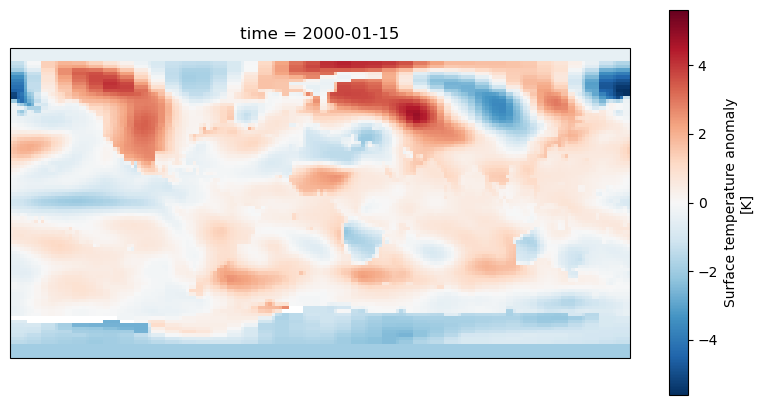
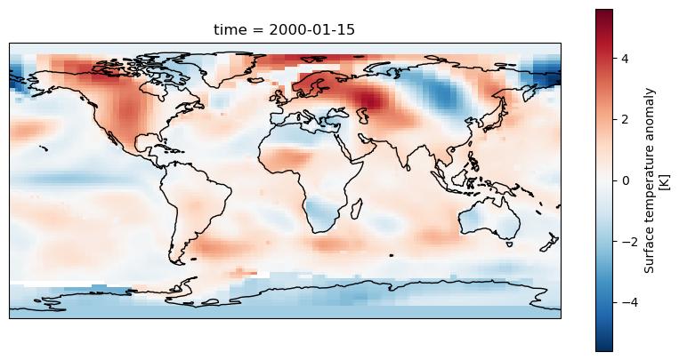
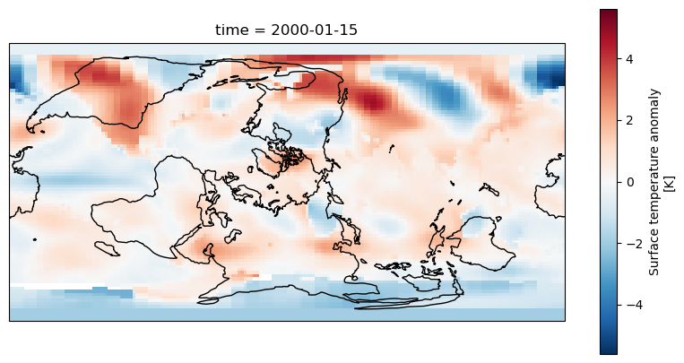
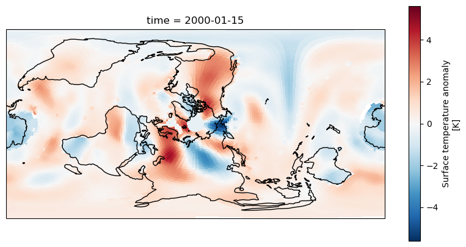
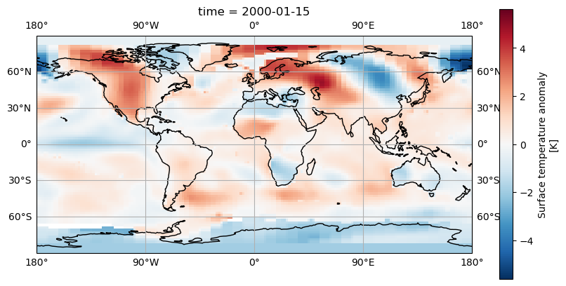
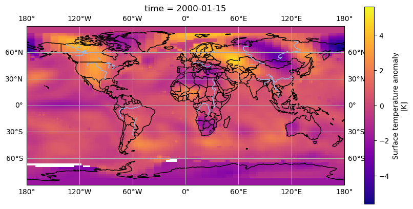
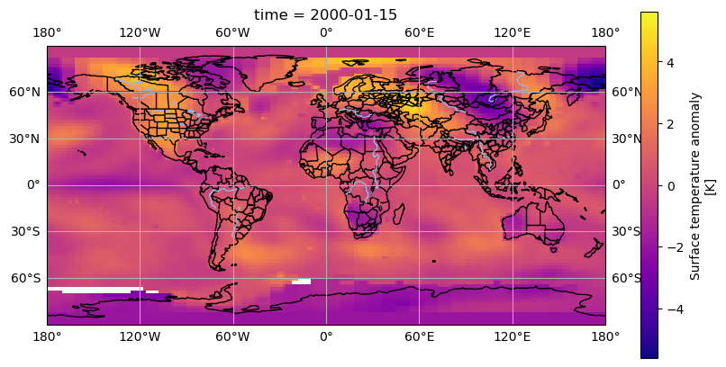

# Plotting Data with Cartopy

We have seen some basic plots created with Xarray and Matplotlib, but when plotting data on a map this was restricted to quite a simple 2D map without any labels or outlines of coastlines or countries.
The [Cartopy](https://scitools.org.uk/cartopy/docs/latest/) library allows us to create high quality map images, with a variety of different projections, map styles and showing the outlines
of coasts and country boundaries.

## Using Xarray data with Cartopy

To plot some Xarray data from our example dataset we'll need to select a single day (or combine multiple days together). As Cartopy can work with array types such as Numpy arrays it will
also work with Xarray arrays.

Let's start a new notebook and do some initial setup to import xarray, cartopy and we'll also need matplotlib since Cartopy uses it.

~~~
import xarray as xr
import cartopy.crs as ccrs
import matplotlib.pyplot as plt
dataset = xr.open_dataset("gistemp1200-21c.nc")
~~~
{: .language-python}

To setup a Cartopy plot we'll need to create a matplotlib figure and add a subplot to it. Cartopy also requires us to specify a map projection, for this example we'll use the PlateCarree
projection. Note that due to how Matplotlib interacts with Jupyter notebooks, the following must all appear in the same cell.
To extract some data from our datset we'll use `dataset['tempanomaly'].sel(time="2000-01-15")` to get the temperature anomaly data for January 15th 2000.

~~~
fig = plt.figure(figsize = (10, 5))
axis = fig.add_subplot(1, 1, 1, projection = ccrs.PlateCarree())
dataset['tempanomaly'].sel(time="2000-01-15").plot(ax = axis)
~~~
{: .language-python}

We should now see a map of the world with the temperature anomaly data, if we look in the top left we can see North America appearing mostly in red and in the lower right Australia in blue,
but much of the other continents are harder to make out. To make it easier we can add coastlines by calling `axis.coastlines()` after the plot. But to make this appear on the same map
as the rest of the plot it needs to be in the same Jupyter cell and we'll have to rerun the whole cell.

~~~
fig = plt.figure(figsize = (10,5))
axis = fig.add_subplot(1, 1, 1, projection = ccrs.PlateCarree())
dataset.tempanomaly.sel(time="2000-01-15").plot(ax = axis)
axis.coastlines()
~~~
{: .language-python}

# Dealing with Projections

Cartopy supports many different map projections which change how the globe is mapped onto a two dimensional surface. This is controlled by the `projection` parameter to `fig.add_subplot`.
One alternative projection we can use is the RotatedPole projection which will project the pole at the centre of the map, this takes two parameters `pole_latitude` and `pole_longitude`
which define the point at which we want to centre the map on.

~~~
fig = plt.figure(figsize=(10,5))
axis = fig.add_subplot(1, 1, 1, projection=ccrs.RotatedPole(pole_longitude=-90, pole_latitude=0))
dataset.tempanomaly.sel(time="2000-01-15").plot(ax = axis)
axis.coastlines()
~~~
{: .language-python}

The above example puts the map into a RotatedPole projection, but notice that the coastlines and coloured areas of the map don't match as they previously did. This is because
we haven't told Cartopy how the data is structured and it has assumed it matches the projection. We didn't need to do this with the PlateCarree projection as the data matched the projection
but now we need to specify an extra `transform` argument to `plot`.

~~~
fig = plt.figure(figsize=(10,5))
axis = fig.add_subplot(1, 1, 1, projection=ccrs.RotatedPole(pole_longitude=-90, pole_latitude=0))
dataset.tempanomaly.sel(time="2000-01-15").plot(ax = axis, transform=ccrs.PlateCarree())
axis.coastlines()
~~~
{: .language-python}

The data should now match the coastlines.

> ## Challenge
> Experiment with the following map projections
> - Mollweide
> - InterruptedGoodeHomolosine
> - Robinson
> - Orthographic (requires latitude and longitue parameters)
> See [https://scitools.org.uk/cartopy/docs/v0.13/crs/projections.html](https://scitools.org.uk/cartopy/docs/v0.13/crs/projections.html) for more options.
> Which do you like the most? Discuss what is the most useful aspects for showing data with the group.
{: .challenge}

# Adding gridlines

Like we added coastlines with `axis.coastlines()` we can add gridlines of latitude and longitude with `axis.gridlines()`. By default these will appear every 60 degrees of longitude and
 every 30 degrees of latitude. We can add labels with the parameter `draw_labels=True`.

~~~
fig = plt.figure(figsize=(10,5))
axis = fig.add_subplot(1, 1, 1, projection=ccrs.PlateCarree())
dataset.tempanomaly.sel(time="2000-01-15").plot(ax = axis, transform=ccrs.PlateCarree())
axis.coastlines()
axis.gridlines(draw_labels=True)
~~~
{: .language-python}

If we'd like the gridlines at a different position we can specify these with Python lists in the `xlocs` and `ylocs` parameters. For example

~~~
fig = plt.figure(figsize=(10,5))
axis = fig.add_subplot(1, 1, 1, projection=ccrs.PlateCarree())
dataset.tempanomaly.sel(time="2000-01-15").plot(ax = axis, transform=ccrs.PlateCarree())
axis.coastlines()
axis.gridlines(draw_labels=True,xlocs=[-180,-90,0,90,180])
~~~
{: .language-python}

A more concise way to do this is to use Numpy's `linspace` function which creates an array of evenly spaced elements, this takes a start, end and number of elements parameter for example:

~~~
import numpy as np
axis.gridlines(draw_labels=True,xlocs=np.linspace(-180,180,5))
~~~
{: .language-python}

# Adding Country/Region boundaries

Cartopy has many common map features including coastlines, lakes, rivers, country boundaries and state/region boundaries that it can draw. These are all available in the `cartopy.feature`
library and can be added using the `add_features` function on a subplot axis.

~~~
import cartopy.feature as cfeature
fig = plt.figure(figsize=(10,5))
axis = fig.add_subplot(1, 1, 1, projection=ccrs.PlateCarree())
dataset.tempanomaly.sel(time="2000-01-15").plot(ax = axis, transform=ccrs.PlateCarree())
axis.coastlines()
axis.gridlines(draw_labels=True)
axis.add_feature(cfeature.BORDERS)
axis.add_feature(cfeature.LAKES)
axis.add_feature(cfeature.RIVERS)
~~~
{: .language-python}

The above code will add country boundaries, lakes and rivers to our map. The lakes and rivers might be a little hard to see in places where there is a blue being used to render the
temperature anomaly. We could apply a different colourmap to avoid this problem, the plasma colourmap in Matplotlib goes from purple, to orange to yellow and shows the contrast with
 the rivers nicely.

~~~
from matplotlib import colormaps
fig = plt.figure(figsize=(10,5))
axis = fig.add_subplot(1, 1, 1, projection=ccrs.PlateCarree())
dataset.tempanomaly.sel(time="2000-01-15").plot(ax = axis, transform=ccrs.PlateCarree(), cmap=colormaps.get_cmap('plasma'))
axis.coastlines()
axis.gridlines(draw_labels=True)
axis.add_feature(cfeature.BORDERS)
axis.add_feature(cfeature.LAKES)
axis.add_feature(cfeature.RIVERS)
~~~
{: .language-python}

> ## Downloading boundary data manually
>
> If you want to download the boundary data yourself (perhaps if you are going to be offline later and want to plot some maps) then you can do this from the Natural Earth website or
> by using a wget or curl command from your terminal. Download the following files:
>
> * [https://naturalearth.s3.amazonaws.com/110m_physical/ne_110m_coastline.zip](https://naturalearth.s3.amazonaws.com/110m_physical/ne_110m_coastline.zip)
> * [https://naturalearth.s3.amazonaws.com/110m_physical/ne_110m_lakes.zip](https://naturalearth.s3.amazonaws.com/110m_physical/ne_110m_lakes.zip)
> * [https://naturalearth.s3.amazonaws.com/110m_physical/ne_110m_rivers_lake_centerlines.zip](https://naturalearth.s3.amazonaws.com/110m_physical/ne_110m_rivers_lake_centerlines.zip)
> * [https://naturalearth.s3.amazonaws.com/110m_cultural/ne_110m_admin_0_boundary_lines_land.zip](https://naturalearth.s3.amazonaws.com/110m_cultural/ne_110m_admin_0_boundary_lines_land.zip)
>
> Unzip these and place the coastlines, lakes and rivers files in `~/.local/share/cartopy/shapefiles/natural_earth/physical`.
>
> Place the boundaries in `~/.local/share/cartopy/shapefiles/natural_earth/cultural`
>
> Cartopy also includes a script called `cartopy_feature_download` which can download these files for you and place them in the correct location.
>
> Here's the commands to do all of this using Cartopy's script:
> ~~~
> cartopy_feature_download physical --output  ~/.local/share/cartopy/shapefiles/natural_earth/physical
> cartopy_feature_download gshhs --output  ~/.local/share/cartopy/shapefiles/natural_earth/physical
> cartopy_feature_download cultural --output  ~/.local/share/cartopy/shapefiles/natural_earth/cultural
> cartopy_feature_download cultural-extra --output  ~/.local/share/cartopy/shapefiles/natural_earth/cultural
> ~~~
> {: .language-bash}
>
> Manual method:
> ~~~
> wget https://naturalearth.s3.amazonaws.com/110m_physical/ne_110m_coastline.zip https://naturalearth.s3.amazonaws.com/110m_physical/ne_110m_lakes.zip https://naturalearth.s3.amazonaws.com/110m_physical/ne_110m_rivers_lake_centerlines.zip https://naturalearth.s3.amazonaws.com/110m_cultural/ne_110m_admin_0_boundary_lines_land.zip
> mkdir -p ~/.local/share/cartopy/shapefiles/natural_earth/cultural
> mkdir -p ~/.local/share/cartopy/shapefiles/natural_earth/physical
> cd ~/.local/share/cartopy/shapefiles/natural_earth/cultural
> conda run -n esces unzip ~/ne_110m_admin_0_boundary_lines_land.zip
> cd ../physical
> conda run -n esces unzip ~/ne_110m_coastline.zip
> conda run -n esces unzip ~/ne_110m_lakes.zip
> conda run -n esces unzip ~/ne_110m_rivers_lake_centerlines.zip
> ~~~
> {: .language-bash}
>
{: .callout}

> ## Challenge
> The [`cartopy.feature.NaturalEarthFeature`](https://scitools.org.uk/cartopy/docs/latest/reference/generated/cartopy.feature.NaturalEarthFeature.html) library allows access to a number
> of boundary features from the shapefiles supplied by the website Natural Earth. One of these has administrative and state boundaries for many countries. Add this feature using the
> "admin_1_states_provinces_lines" dataset. Use the 50m (1:50 million) scale for this.
> > ## Solution
> > ~~~
> > states_provinces = cfeature.NaturalEarthFeature(
> >        category='cultural',
> >        name='admin_1_states_provinces_lines',
> >        scale='50m',
> >        facecolor='none')
> > axis.add_feature(states_provinces)
> > ~~~
> > {: .language-python}
> > 
> {: .solution}
{: .challenge}


