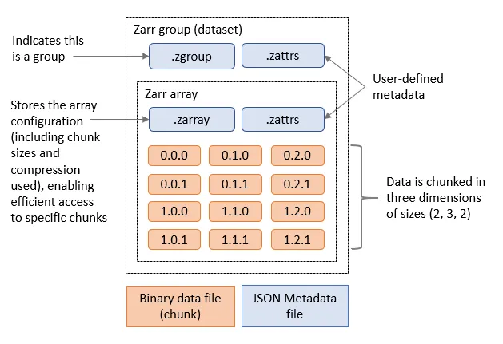

# Data Access Speeds

The time spent accessing data from disk is orders of magnitude more than accessing data stored in RAM and accessing data over a network is orders of magnitude more than
accessing data on a local disk. This is visualised nicely in the diagram below

(from [https://gist.github.com/hellerbarde/2843375](https://gist.github.com/hellerbarde/2843375))

Lets multiply all these durations by a billion:

Magnitudes:

Minute:
 - L1 cache reference                  0.5 s         One heart beat (0.5 s)
 - Branch mispredict                   5 s           Yawn
 - L2 cache reference                  7 s           Long yawn
 - Mutex lock/unlock                   25 s          Making a coffee

Hour:
 - Main memory reference               100 s         Brushing your teeth
 - Compress 1K bytes with Zippy        50 min        One episode of a TV show (including ad breaks)

Day:
 - Send 2K bytes over 1 Gbps network   5.5 hr        From lunch to end of work day

Week
 - SSD random read                     1.7 days      A normal weekend
 - Read 1 MB sequentially from memory  2.9 days      A long weekend
 - Round trip within same datacenter   5.8 days      A medium vacation
 - Read 1 MB sequentially from SSD    11.6 days      Waiting for almost 2 weeks for a delivery

Year
 - Disk seek                           16.5 weeks    A semester in university
 - Read 1 MB sequentially from disk    7.8 months    Almost producing a new human being
 - The above 2 together                1 year

Decade
 - Send packet CA->Netherlands->CA     4.8 years     Average time it takes to complete a bachelor's degree

We are going to have to wait a really long time to get data from the internet when compared to processing it locally. But in the modern era when we might be working
with multiterabyte (or even petabyte) datasets it isn't likely to be practical to store it all on our local computer. By applying parallel working patterns we can also
have multiple computers each compute part of a dataset and/or we can have multiple computers each store part of the dataset allowing us to transfer several parts of it in parallel.

## Parallel Filesystems

On many high performance computing (HPC) systems it is common for there to be a large parallel filesystem. These will spread data across a large number of physical disks and servers,
when a user requests some data it might be supplied by several servers simultaneously. Since each disk can only supply data so fast (usually between 10s and 100s of megabytes per second)
we can achieve faster data access by requesting from several disks spread across several servers. Many parallel filesystems will be configured to provide access speeds of
multiple gigabytes per second. However HPC systems also tend to be shared systems with many users all running different tasks at any given time, so the activities of other
users will also impact how quickly we can access data.

# Object Stores

Object stores are a scalable way to store data in a manner that is readily accessible over the internet. They use the Hyper Text Transfer Protocol (HTTP) or its secure alternatie
(HTTPS) to access "objects". In this case each object will have a unique URL and the appearance of a file on a filesystem. Where object stores differ from traditional filesystem
is that there isn't any directory hierarchy to the objects, although sometimes object stores are configured to give the illusion of this. For example we might create object
names that contain path separators. The underlying storage can "stripe" the data of an object across several disks and/or servers to achieve higher throughput speeds in a similar
way to the parallel filesystems described above, this can allow object stores to scale very well to store both large numbers of objects and very large individual objects. Some
object stores will also replicate an object across several locations to both improve reslience and performance.

Another benefit of object stores is that they allow clients to request just part of an object, this has spawned a number of "cloud optimised" file formats where some metadata
describes what can be found in what part of the object and the client then requests only what it needs. This could be especially useful if say we have a very high resolution
geospatial dataset and only wish to retreive the part relating to a specific area or we have a dataset which spans a long time period and we're only interested in a short time
period.

One of the most popular object stores is Amazon's S3 which is used by many websites to store their contents. S3 is accessed via HTTP, typically using the GET method to request
and object or using the PUT or DELETE methods. S3 also has a lot of features to manage who can access an object and whether they can only read it or read and write it. Many other
object stores copy the S3 protocol both for accessing objects, managing permissions and metadata associated with them.

# Zarr files

Zarr is a cloud optimised file format designed for working with multidimensional data. Its is very similar to NetCDF, but it splits up data into chunks. When requesting the
Zarr file from an object store (or a local disk) we can limit which chunks we transfer. Zarr files contain a header which describes the structure of the file and information
about the chunks, when loading the file this header will be loaded to allow the Zarr library to know about the rest of the file. Zarr is also designed to support multiple concurrent readers, allowing us to read the
file in parallel using multiple threads or even with Dask tasks that are distributed across multiple computers. Zarr has been built with Python in mind and has libraries to
allow native Python operations on Zarr. There is support for Zarr in other languages such as C in the recent versions of the NetCDF libraries.

## Zarr and Xarray

Xarray can open Zarr files using the `open_zarr` function that is similar to the `open_dataset` function we've been using to open NetCDF data. We will be using the outputs of the [NEMO Near-Present-Day simulations developed by the National Oceanography Centre](https://noc-msm.github.io/NOC_Near_Present_Day/), specifically related to the eORCA025 model and covers the ocean globally. Each dataset can have more than 200GB, DO NOT DOWNLOAD IT!

~~~
import xarray as xr

ds = xr.open_zarr("https://noc-msm-o.s3-ext.jc.rl.ac.uk/npd-eorca025-jra55v1/T1m/so_abs")
ds
~~~
{: .language-python}

We can now see the metadata for the Zarr file. It includes 75 depth levels, 577 time steps and a 1206x1440
spatial resolution. In this case, there is only one variable, `so_abs`, which is the absolute salinity of the ocean. To access other variables, you can take a look on the [NOC Near-Present-Day documentation](https://noc-msm.github.io/NOC_Near_Present_Day/outputs). For example:

~~~
import xarray as xr

ds = xr.open_zarr("https://noc-msm-o.s3-ext.jc.rl.ac.uk/npd-eorca025-jra55v1/T1m/zos")
ds
~~~
{: .language-python}

In this case, the variable is `zos`, which is the "Sea Surface Height Above Geoid". It only covers the ocean surface and don't use the depth dimension. All of this information has come from the header of the Zarr file,
so far none of the actual data has been transferred, we have done what is known as a "lazy load" where data will only be transferred from the object store when we actually access it.

Let's try and read it by slicing out a small part of the file, we'll only get the `zos` dataset:

~~~
ssh = ds['zos'].isel(time_counter=slice(0,1),y=slice(500,700), x=slice(1000,1200))
ssh
~~~
{: .language-python}

We can see that `ssh` is now a 200x200x1 array that only takes up 156.25kB from the original 3.73GB file. Even at this point no data will have been transferred.
If we explore further and print the `ssh` array we'll see that it is actually using a Dask array underneath.

~~~
print(ssh)
~~~
{: .language-python}

To convert this into a standard Xarray DataArray we can call `.compute` on the `ssh`.

~~~
ssh_local = ssh.compute()
~~~
{: .language-python}

We can now plot this by using:
~~~
ssh_local.plot()
~~~
{: .language-python}

Or access some of the data:

~~~
ssh_local[0,0,0]
~~~
{: .language-python}

It is important to note that this data is not on a regular grid. Therefore, slicing the data using `isel` will not give you an exact rectangular area, but only the data that lies within the boundaries of the grid. If you want to get a specific area, you may need to reproject the data to a regular grid. There are python libraries like `iris` and `xESMF` that help with this activity,

> ## Plot Sea Surface Temperature
> Extract and plot the sea surface temperature (`tos_con` variable from the `https://noc-msm-o.s3-ext.jc.rl.ac.uk/npd-eorca025-jra55v1/T1m/tos_con` file) for the nearest date to January 1st 1965 that is in the dataset.
>> ## Solution 1
>> ~~~
>> import xarray as xr
>> ds = xr.open_zarr("https://noc-msm-o.s3-ext.jc.rl.ac.uk/npd-eorca025-jra55v1/T1m/tos_con")
>> sst = ds['tos_con'].sel(time_counter="1965-01-01",method="nearest")
>> sst.plot()
>> ~~~
>> {: .language-python}
> {: .solution}
>
>> ## Solution 2: (OPTIONAL) plotting with Cartopy
>> ~~~
>> import xarray as xr
>> import matplotlib.pyplot as plt
>> import cartopy.crs as ccrs
>> import cartopy.feature as cfeature
>> ds = xr.open_zarr("https://noc-msm-o.s3-ext.jc.rl.ac.uk/npd-eorca025-jra55v1/T1m/tos_con")
>> sst = ds['tos_con'].sel(time_counter="1965-01-01",method="nearest")
>>
>> plt.figure(figsize=(12, 6))
>> ax = plt.axes(projection=ccrs.PlateCarree())
>>
>> # Add white land background
>> ax.add_feature(cfeature.LAND, facecolor='white', zorder=1)
>>
>> ax.coastlines()
>> pcm = ax.pcolormesh(
>>     sst.nav_lon, sst.nav_lat, sst,
>>     transform=ccrs.PlateCarree(),
>>     cmap="viridis",
>>     shading="auto",
>>     zorder=0  # Ensure it overlays the land
>> )
>>
>> plt.title("Sea Surface Temperature with White Land")
>> plt.colorbar(pcm, label=sst.attrs.get("units", ""))
>> plt.tight_layout()
>> plt.show()
>> ~~~
>> {: .language-python}
> {: .solution}
>
>> ## Solution 3: (OPTIONAL) reprojecting and plotting with Cartopy
>> ~~~
>> # you will need to install xESMF to run this solution
>> # conda install -c conda-forge "esmpy=8.6.1" "esmf=8.6.1"
>> import xesmf as xe
>> import xarray as xr
>> import matplotlib.pyplot as plt
>> import cartopy.crs as ccrs
>> ds = xr.open_zarr("https://noc-msm-o.s3-ext.jc.rl.ac.uk/npd-eorca025-jra55v1/T1m/tos_con")
>> sst = ds['tos_con'].sel(time_counter="1965-01-01",method="nearest")
>> sst = sst.rename({'nav_lon': 'lon', 'nav_lat': 'lat'})
>> # Create source and target grids
>> ds = sst.to_dataset(name="tos_con")
>> # Define target regular grid (e.g., 1°)
>> import numpy as np
>> lon_target = np.linspace(-180, 180, 360)
>> lat_target = np.linspace(-90, 90, 180)
>> target_grid = xr.Dataset({
>>     "lon": (["lon"], lon_target),
>>     "lat": (["lat"], lat_target),
>> })
>> # Regrid
>> regridder = xe.Regridder(ds, target_grid, method="bilinear", periodic=True)
>> tos_regridded = regridder(ds)["tos_con"]
>>
>> # Plotting the regridded data
>> plt.figure(figsize=(12, 6))
>> ax = plt.axes(projection=ccrs.PlateCarree())
>> pcm = ax.pcolormesh(
>>     tos_regridded["lon"], tos_regridded["lat"],
>>     tos_regridded, transform=ccrs.PlateCarree(),
>>     cmap="viridis"
>> )
>> ax.coastlines()
>> plt.title("Regridded Sea Surface Temperature")
>> plt.colorbar(pcm, label=sst.attrs.get("units", ""))
>> plt.tight_layout()
>> ~~~
>> {: .language-python}
> {: .solution}
{: .challenge}

> ## Calculate the mean sea surface temperature for two years
> Calculate the mean sea surface temperature for the years between 1990 and 1991 using the same dataset as above.
>> ## Solution
>> ~~~
>> import xarray as xr
>> ds = xr.open_zarr("https://noc-msm-o.s3-ext.jc.rl.ac.uk/npd-eorca025-jra55v1/T1m/tos_con")
>> sst = ds['tos_con'].sel(time_counter=slice("1990", "1991"))
>> grouped_mean = sst.groupby("time_counter.year").mean()
>> mean_sst = grouped_mean.mean(dim=['y','x']) # this will take the mean across the specified dimensions
>> mean_sst = mean_sst.compute()
>> mean_sst
>> ~~~
>> {: .language-python}
> {: .solution}
{: .challenge}

> ## Calculate the mean sea surface temperature for 10 years with Dask
> Calculate the mean sea surface temperature for 1990 and 1999. Use the JASMIN Dask gateway to parallelise the calculation, use 10 worker threads and set the
> time_counter chunk size to 10 when opening the zarr file. Measure how long it takes to compute the result, try changing the number of workers up and down to see
> what the optimal number is.
>> ## Solution
>> ~~~
>> import xarray as xr
>> import dask_gateway
>>
>> gw = dask_gateway.Gateway("https://dask-gateway.jasmin.ac.uk", auth="jupyterhub")
>>
>> options = gw.cluster_options()
>> options.worker_cores = 1
>> options.scheduler_cores = 1
>> options.worker_setup='source /apps/jasmin/jaspy/miniforge_envs/jaspy3.11/mf3-23.11.0-0/bin/activate ~/.conda/envs/esces'
>>
>> clusters = gw.list_clusters()
>> if not clusters:
>>     cluster = gw.new_cluster(options, shutdown_on_close=False)
>> else:
>>     cluster = gw.connect(clusters[0].name)
>>
>> client = cluster.get_client()
>> cluster.adapt(minimum=1, maximum=10)
>> client
>>
>> ds = xr.open_zarr("https://noc-msm-o.s3-ext.jc.rl.ac.uk/npd-eorca025-jra55v1/T1m/tos_con")
>> sst = ds['tos_con'].sel(time_counter=slice("1990","1999"))
>> # mean_sst = dataset.mean(dim=['lat','lon']) #better way to do this
>> grouped_mean = sst.groupby("time_counter.year").mean()
>> mean_sst = grouped_mean.mean(dim=['y','x'])
>> result = client.compute(mean_sst).result()
>> result.plot()
>> cluster.shutdown()
>> ~~~
>> {: .language-python}
>> Optimal workers is probably 10 and execution should take around 22 seconds. Single threaded execution time is 57 seconds.
> {: .solution}
{: .challenge}

# Data Catalogues

It is a common problem that environmental scientists will need to work with datasets that span across many files. There is a common practice with larger datasets stored in
Zarr or NetCDF formats to split them into multiple files with either one variable per file or one time period per file. Once we have more than a few files in our dataset
keeping the correct filenames or URLs can become more difficult, especially if those names change or data gets relocated.

There are several ways to solve this problem, most of then related on building a catalogue of the dataset. This catalogue can be a simple text file that lists the filenames and URLs of the files in the dataset ([like this example](https://raw.githubusercontent.com/NOC-MSM/NOC_Near_Present_Day/main/jasmin_os/catalogs/npd_jra55_v1_catalog.csv)), or it can be a more complex database or catalogue that stores metadata about the files and their contents.

Two most used catalogues for this type of data are [STAC](https://stacspec.org/) and [Intake](https://github.com/intake/intake). STAC is a standard for describing geospatial data in a way that allows it to be easily discovered and accessed, while Intake is a Python library that provides a way to manage and access datasets in a more flexible way. We will show an example using intake.

To open a catalogue we call the `open_catalog` function in the intake library. By converting the response of this to a Python list we can find the names of all of the datasets
in the catalogue.

~~~
import intake
xcat = intake.open_catalog('https://raw.githubusercontent.com/intake/intake-xarray/master/examples/catalog.yml')
list(xcat)
~~~
{: .langauge-python}

Let's open the image example and use the skimage library to plot it

~~~
import matplotlib.pyplot as plt
image = xcat.image.read()
plt.imshow(image)
~~~
{: .langauge-python}


